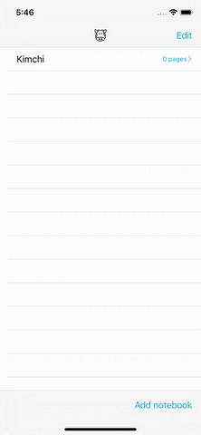

# MooskineApp
Udacity iOS Nanodegree Project

#### Summary 
This application was created specifically for Udacity's iOS Developer Nanodegree. Mooskine app allows users to create notbooks and notes and persist data using core data.

#### Requirements
- Xcode 11.4
- Swift 5

#### Technologies Used In Application:
- CoreData
- Stack views
- Table view
- Swift
